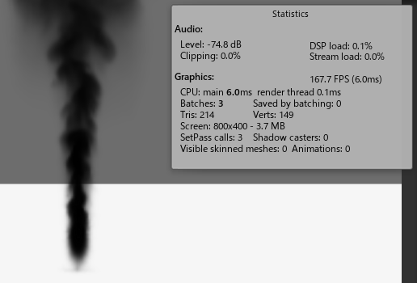

# TinyOptimization-GPU-GEMS-3D-Fluid-Simulation
 
This code is a tiny optimized version of [GPU-GEMS-3D-Fluid-Simulation](https://github.com/Scrawk/GPU-GEMS-3D-Fluid-Simulation).

- Reduce if statements
- Use RenderTexture instead of ComputeBuffer

#### Original

#### Tiny Optimization
